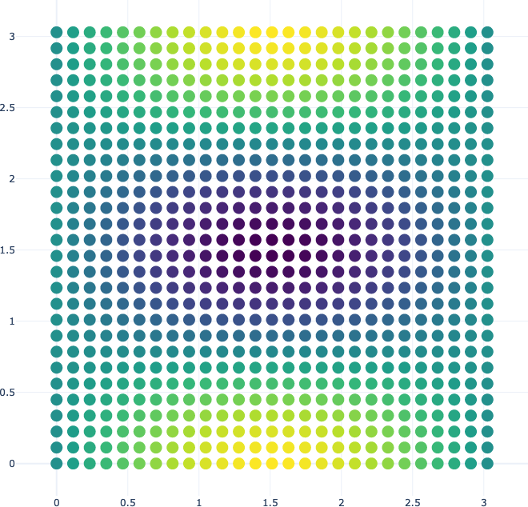

# mp-pyrho
[](https://github.com/materialsproject/pyRho/actions?query=workflow%3Atesting)
[](https://codecov.io/gh/materialsproject/pyRho?branch=master)

Tools for re-griding volumetric quantum chemistry data for machine-learning purposes.

- Free software: BSD license
- Documentation: <https://src.readthedocs.io>.

## Features

- Restructuring of periodic grid data (mapping from one cell representation to another)
- Up-sampling of periodic grid data using fourier interpolation
- Helper functions to plot examine the data

# Example Usage

The `PGrid` object is defined by an N-dimensional numpy array `grid_data` and a N lattice vectors given as a matrix `lattice`.
The input array is a scalar field that is defined on a regularly spaced set of grid points starting at the origin.
For example, you can construct a periodic field as follows:
```python
import numpy as np
from pyrho.core.pgrid import PGrid
from pyrho.vis.plotly import get_plotly_scatter_plot

def func(X,Y):
    return np.sin(X) * np.cos(2*Y)
a = np.linspace(0, np.pi, 27,endpoint=True)
b = np.linspace(0, np.pi, 28,endpoint=True)
arg_ = np.meshgrid(a, b, indexing='ij')
data = func(*arg_)
pg = PGrid(grid_data=data, lattice=[[np.pi,0], [0,np.pi]])
get_plotly_scatter_plot(pg.grid_data, pg.lattice, skips=1, opacity=1, marker_size=15)
```
The data can be examined using the helper plotting function.


The PGrid object has no concept of normalization so if you half the number of points in the domain, the range of the data will stay the same.
This is different from how change density is stored in codes like VASP where the values at each point depends on the number of grid points used to store the data.

The regridding capabilties allows the user to obtain the data in any arbitrary representation.
For example if we want to shift to the middle of the unitcell and create a ((1,1), (1,-1)) supercell,
with a 30 by 32 grid, we can run:

```python
pg_2x = pg.get_transformed_obj([[1,1], [1,-1]], frac_shift=[0.5, 0.5], grid_out=[30,32])
print(f"After doubling, rorating and shifting the (max, min) "
      "of the data changed from ({pg.grid_data.max():0.2f}, {pg.grid_data.min():0.2f}) "
      "to ({pg_2x.grid_data.max():0.2f}, {pg_2x.grid_data.min():0.2f})")
get_plotly_scatter_plot(pg_2x.grid_data, pg_2x.lattice, skips=1, opacity=1, marker_size=10)
```


```python
from pymatgen.io.vasp import Chgcar
from pyrho.core.chargeDensity import ChargeDensity
chgcar = Chgcar.from_hdf5("../test_files/Si.uc.hdf5")
chgcar = ChargeDensity.from_pmg_volumetric_data(chgcar)
get_plotly_scatter_plot(chgcar.grid_data,
                        lat_mat=chgcar.lattice,
                        factor=4,
                        mask=chgcar.grid_data > 0.3)
```

## Credits

Jimmy-Xuan Shen: project lead
