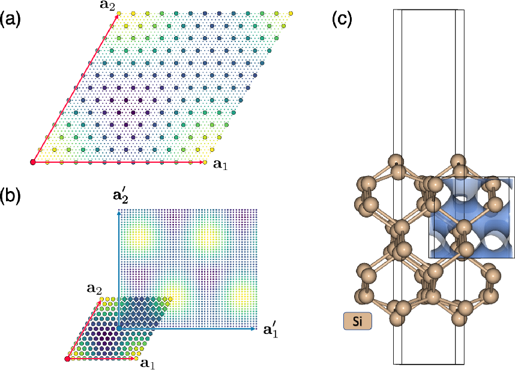

# Summary

The electronic charge density is a central quantity in the field of computational material science.
Since most materials simulations codes, such as the Vienna Ab initio Simulation Package (VASP) and Quantum ESPRESSO, assume periodic boundary conditions, the calculations usually stores the charge densities on a three-dimensional grid that is regular in the directions of the lattice parameters.
This makes the calculations, especially performing FFT's on these charge densities traighforward.
However, these non-orthogonal, and more importantly material-specific grids, means that we cannot directly compare the charge densities from different simulations.
Despite how data-rich the charge densities are, using periodic charge densities for machine learning is difficult because:

1. Different charge densities are usually stored on non-comensurate grids, meaning that one deep-learning Convolutional Neural Network (CNN) cannot be trained to process different crystal structures.

2. Only a single charge density is generated for each simulation, this is not ideal for Deep Learning since we want to train on data sets that represent many copies of the same system.  This is like trying to train a CNN to recognize a cat by only showing it one picture of a cat.

The `mp-pyRho` package aims to give users full control over the how the charge density is represented.
The input data can be thought of as an infinte periodic field, and the goal of this package is to allow the users to crop out a parallelepiped of arbitrary shape, position, orientation, and grid density.
If the output grids are cubic with the same dimensions, then they can be used as inputs for deep learning applications.

`mp-pyRho` is a Python package that allows users to control the repsentation of periodic data in arbitray dimensions.
The matematics of the re-gridding relies on `scipy.interpolate` and is general for all dimensions.
However, special considertion was given to the case of 3D data, where we have integrated with the `VolumetricData` objects from the `pymatgen` package [@pymatgen].

The code is responsible for:
1. Up-scaling the periodic data to a higher resolution grid using Fourier interpolation.

2. Re-gridding the data on a new grid, with arbitrary shape, position, and orientation.

3. Creat arbitrary crops of the periodic data.

All three of these capabilities can be seen in Figure 1. 

As charge density data become more availibe through modern quantum chemistry databases, The cropping capabilities of `mp-pyRho` can process these data sets and make them more accessible for machine learning applications.

# Statement of need

Grid-interpolation and grid-restructuring are common tasks in computational geometry, and efficient algorithms exist to perform these tasks.
However, since 3D periodic data is extremely common in computational materials science and not common elsewhere, there is a lack of software that is specifically designed to handle this type of data.
`mp-pyRho` is designed to be a general tool for regridding periodic data, and we have integrated it with the `VolumetricData` objects from the `pymatgen` package [@pymatgen] to make it easy to use for materials science applications.

# Acknowledgements

We acknowledge contributions from Jason M. Munro, Matthew K. Horton, and Shyam Dwaraknath for their help with the development of this software.